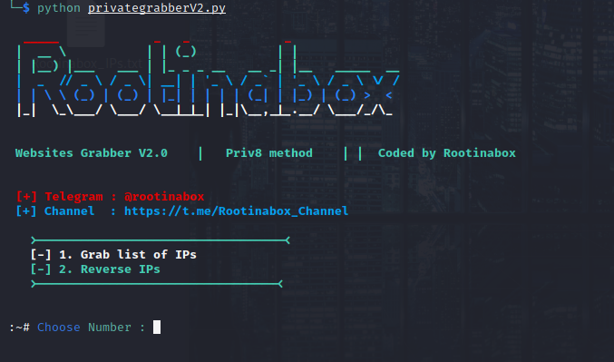

# Mass Websites Grabber V2


## What can it do?
This is a newer version of mass website grabber 
the bot have 2 options
1. Grab List of IPs (Fresh)
2. Reverse IPs (Unlimited)

---

## Requirements
* Python 2.7.14
* pip
* requests (see [Installation](#Installation))
* coloraama (see [Installation](#Installation))
* urllib2 (see [Installation](#Installation))

---

## Installation
You can just install the dependencies using pip: `pip install -r requirements.txt`

If you want to manually install the required packages using your preferrec package manager, see [requirements.txt](requirements.txt) for a list of packages

---
**Linux**
```bash
apt install git python2-pip
git clone https://github.com/rootinabox/Mass-Websites-Grabber-V2
cd Mass-Websites-Grabber-V2 
pip install colorama
pip install requests
python privategrabber.py
```
**Windows**
```
install python 2.7.14 ( add python to path )
pip install requests
pip install colorama
pip install urllib2
cd Mass-Websites-Grabber-V2
python privategrabberV2.py
```



## Issues & Features
If you find any problems or have a feature request, feel free to contact me.

Telegram : @rootinabox

Channel  : https://t.me/Rootinabox_Channel
---
